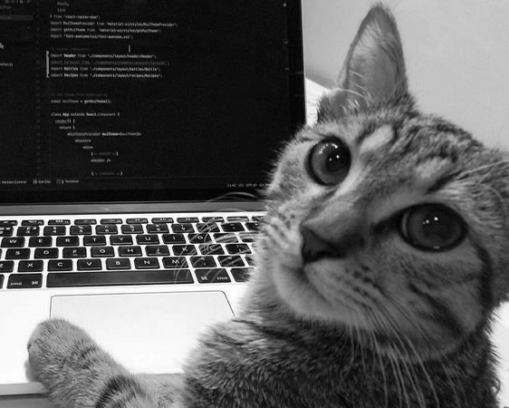

  

## Olá, eu sou a Manuela Crespo! ✌🏼

- 📍 Florianópolis, SC
- 🎓 Estudante de Design de Produto no IFSC (2026)
- 💻 A frequentar o curso de UX/UI e Front-End na EBAC

###  Projetos Recentes 💻 📱 

* **[Hub de Links Personalizado](https://less-manuela-crespo.vercel.app/)** 💻 📱 (desktop e mobile)
    * Página responsiva de apresentação de projetos desenvolvida com o pré-processador **[LESS](https://lesscss.org/)**.

* **[Landing Page](https://bemsassproject.vercel.app/)** 💻 (desktop)
    * Desenvolvimento de uma interface desktop utilizando a metodologia **[BEM](https://getbem.com/)** para organização de classes e **[SASS](https://sass-lang.com/)** para a gestão de estilos e cores.
    
* **[Sorteador de Números](https://sorteadorgrunt-six-blush.vercel.app)** 💻 (desktop)
    * Projeto focado em automação de fluxo de trabalho utilizando **[Grunt](https://gruntjs.com/)**.
      

### Toolbox

  
  
  
  
  
  
  

<!--
**crespomanuela/crespomanuela** is a ✨ _special_ ✨ repository because its `README.md` (this file) appears on your GitHub profile.

Here are some ideas to get you started:

- 🔭 I’m currently working on ...
- 🌱 I’m currently learning ...
- 👯 I’m looking to collaborate on ...
- 🤔 I’m looking for help with ...
- 💬 Ask me about ...
- 📫 How to reach me: ...
- 😄 Pronouns: ...
- ⚡ Fun fact: ...
-->
