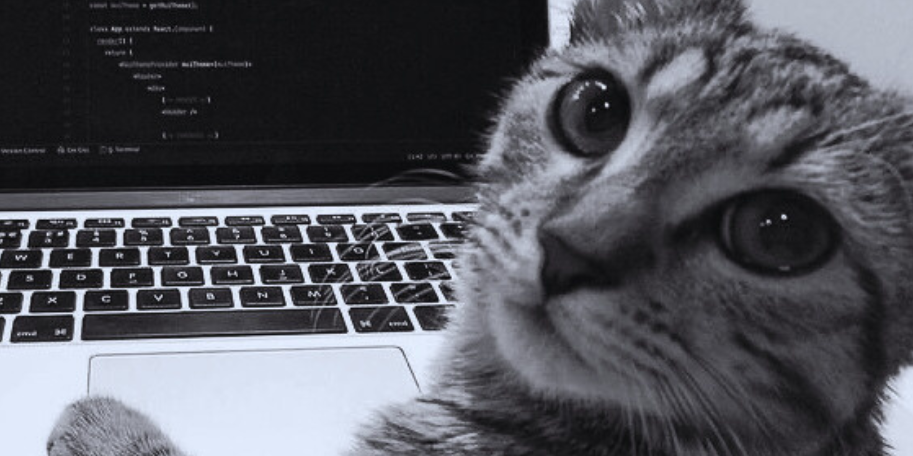

  

## Hi, I'm Manuela Crespo! ✌🏼

- 📍 Florianópolis, Brazil
- 🎓 Product Design Student at IFSC (Class of 2026)
- 💻 Currently studying UX/UI Design & Front-End at EBAC

###  Recent Projects 💻 📱 

* **[Custom Link Hub](https://less-manuela-crespo.vercel.app/)** 💻 📱 (desktop e mobile)
    * Responsive project showcase page developed using the **[LESS](https://lesscss.org/)**.

* **[Landing Page](https://bemsassproject.vercel.app/)** 💻 (desktop)
    * Desktop interface development using **[BEM](https://getbem.com/)** methodology for class organization and **[SASS](https://sass-lang.com/)** for style and color management.
    
      

### Toolbox

  #### Design
  

  #### 3D
  

  #### Frontend
  
  
  
  
  

<!--
**crespomanuela/crespomanuela** is a ✨ _special_ ✨ repository because its `README.md` (this file) appears on your GitHub profile.

Here are some ideas to get you started:

- 🔭 I’m currently working on ...
- 🌱 I’m currently learning ...
- 👯 I’m looking to collaborate on ...
- 🤔 I’m looking for help with ...
- 💬 Ask me about ...
- 📫 How to reach me: ...
- 😄 Pronouns: ...
- ⚡ Fun fact: ...
-->
