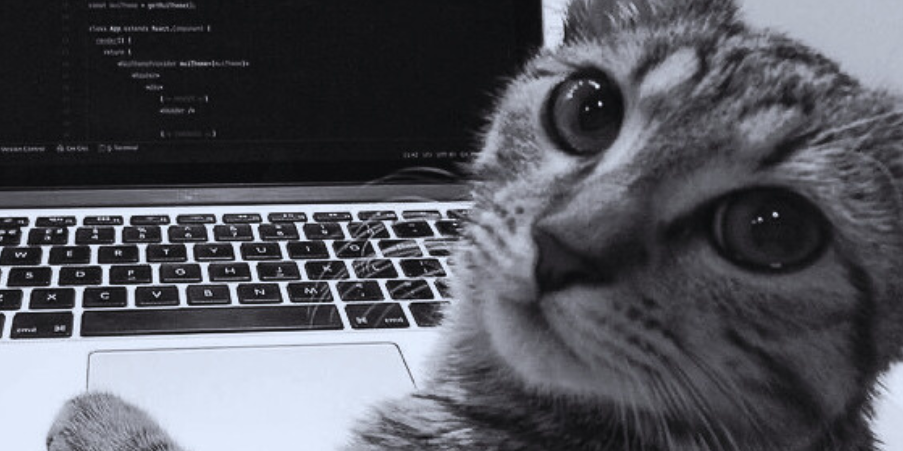

  

## Hi, I'm Manuela Crespo! ✌🏼

- 📍 Florianópolis, Brazil
- 🎓 Product Design Student at IFSC (Class of 2026)
- 💻 Currently studying UX/UI Design & Front-End at EBAC

###  Recent Projects 

* **[Star Wars](https://star-wars-home-page.vercel.app)** 💻📱

  * This project was developed using the **[SMACSS ](https://smacss.com)** (Scalable and Modular Architecture for CSS) methodology to ensure a maintainable and organized codebase, combined with the **[BEM Methodology](https://getbem.com/)**  naming convention to create clear, decoupled, reusable styles. Using **[SASS (SCSS)](https://sass-lang.com/)**, I applied advanced features such as nesting, variables, and modules to streamline the development of a  Star Wars-themed interface. A key highlight of the project is the Millennium Falcon's cinematic movement, achieved with the modern [CSS](https://www.w3schools.com/cssref/css_pr_offset-path.php) offset-path property. This let me define a specific geometric trajectory for the ship, creating a dynamic flight effect beyond traditional linear transformations. To manage the workflow, I implemented a custom **[Gulp.js](https://gulpjs.com/)** automation script in gulpfile.js that compiles stylesheets and compresses files heavily. This ensures all assets are optimized for high performance and fast loading when deployed on **[Vercel](https://vercel.com/)**.

* **[Disney+ Clone](https://disneyplusclone-brown.vercel.app/)** 💻📱

    * This project is a responsive landing page inspired by an older version of the Disney+ website, developed using **[HTML5](https://developer.mozilla.org/en-US/docs/Web/HTML)** for semantic structure and **[SASS (SCSS)](https://sass-lang.com/)** for advanced styling. Following the **[BEM Methodology](https://getbem.com/)** to ensure a clean and organized CSS architecture. The entire workflow is automated with **[Gulp.js](https://gulpjs.com/)**, which handles SCSS compilation and asset optimization, while **[JavaScript](https://developer.mozilla.org/en-US/docs/Web/JavaScript)** manages interactive components such as tab navigation, all hosted and deployed on **[Vercel](https://vercel.com/)** for a seamless mobile and desktop experience.

* **[Custom Link Hub](https://less-manuela-crespo.vercel.app/)** 💻 📱
    * Responsive project showcase page developed using the **[LESS](https://lesscss.org/)**.

* **[Landing Page](https://bemsassproject.vercel.app/)** 💻
    * Desktop interface development using **[BEM](https://getbem.com/)** methodology for class organization and **[SASS](https://sass-lang.com/)** for style and color management.
    
      

### Toolbox

  #### Design
  

  #### 3D
  

  #### Frontend
  
  
  
  
  

<!--
**crespomanuela/crespomanuela** is a ✨ _special_ ✨ repository because its `README.md` (this file) appears on your GitHub profile.

Here are some ideas to get you started:

- 🔭 I’m currently working on ...
- 🌱 I’m currently learning ...
- 👯 I’m looking to collaborate on ...
- 🤔 I’m looking for help with ...
- 💬 Ask me about ...
- 📫 How to reach me: ...
- 😄 Pronouns: ...
- ⚡ Fun fact: ...
-->
